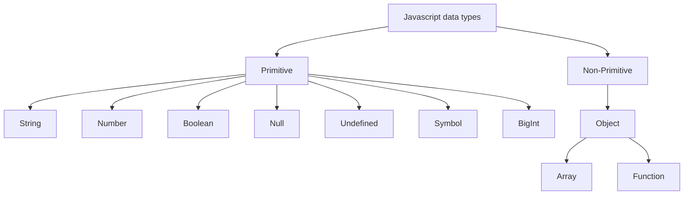

```mermaid
graph TD
  A["Javascript data types"]
    A --> B[Primitive]
      B --> String
      B --> Number
      B --> Boolean
      B --> Null
      B --> Undefined
      B --> Symbol
      B --> BigInt
    A --> C[Non-Primitive]
      C --> E[Object]
        E --> Array
        E --> Function
```
